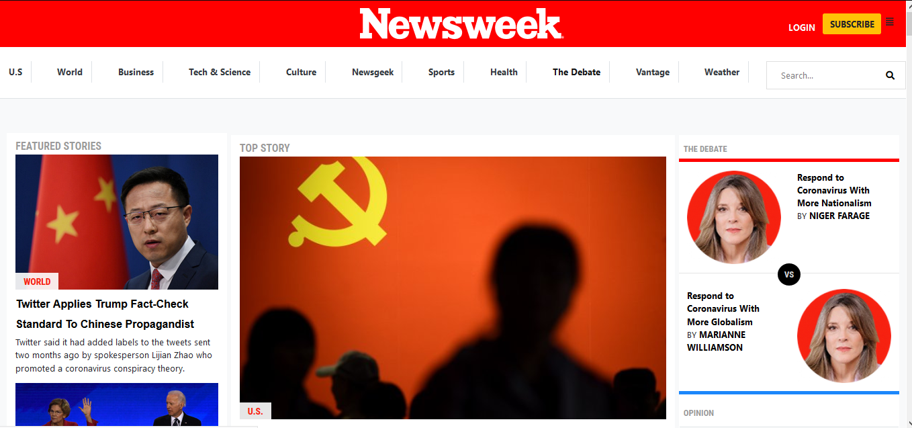

# Using Bootstrap
This project requests students to build a replica of the news site Newsweek.com using the Bootstrap framework.

 > I replicated the newssite Newsweek.com including their responsiveness for smaller screens.
 
 
 

 Additional description about the project and its features.

## Built With

- HTML
- CSS
- Bootstrap

## Live Demo

[Live Demo Link]()

## Getting Started

To get a local copy up and running follow these simple example steps.

- Open a web browser

- [Visit Repository](https://github.com/SigmaSam/Using-Bootstrap)

- Download Repository

- Run index.html file (into folder html)

## Author

**Samuel Isaac Almao Herrera**

- Github [@SigmaSam] (https://github.com/SigmaSam)

Contributions, issues and feature requests are welcome!

Feel free to check the [issues page](https://github.com/SigmaSam/Building-with-Responsive-Design-Samuel-Juan/issues).

## Show your support

Give a  if you like this project!

## Acknowledgments

- Hat tip to anyone whose code was used.
- Inspiration.
- etc.

## License

This project is [MIT](lic.url) licensed.
